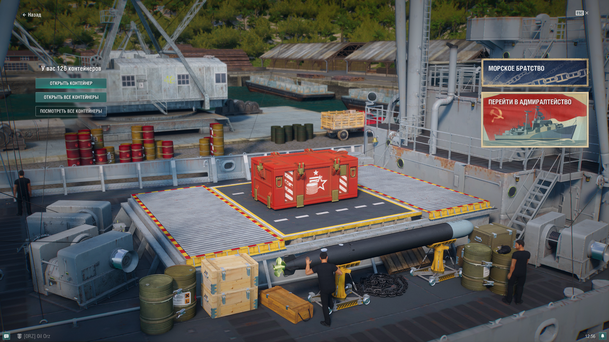

# mxPort

Модификация игры "Мир кораблей" для изменения макета экрана лутбоксов.

Все элементы управления ящиками перемещены в левую часть экрана.

1. Чтобы не перекрывать уведомления
1. и мне кажется более естественным иметь элементы управления слева.



# Установить

- Скачайте архив .zip со страницы [форума](https://forum.korabli.su/topic/158869-).

- Откройте папку с игрой, найдите в ней папку bin и перейдите в нее.
- В ней будут папки с числовыми названиями — это версии игры.
- Как правило, фактическая версия имеет наибольшее число.
- Перейдите в нее и откройте с ее помощью папку mods.
- Должно получиться что-то вроде D:\Games\Korabli\bin\6775398\mods
- Вот в эту папку скопируйте скачанный файл.

# Соберите сами

1. Установите python 3.X, git
1. Клонируйте репозиторий
```git clone https://github.com/qMBQx8GH/mxPort```
1. Измените каталог на mxPort
```cd mxPort```
1. Переключитесь на ветку mkmod
```git checkout mkmod```
1. Скопируйте и отредактируйте build.ini.dist
```cp build.ini.dist build.ini```
1. Создайте архив для распаковки в папку bin\NNNNNNNN\res_mods в игре.
```python make_mod.py build.ini```
